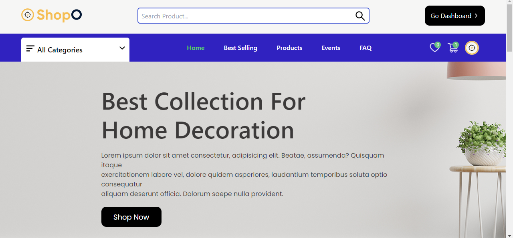
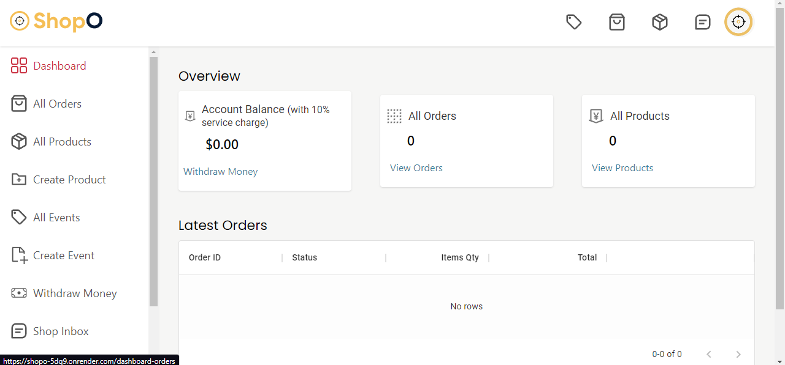
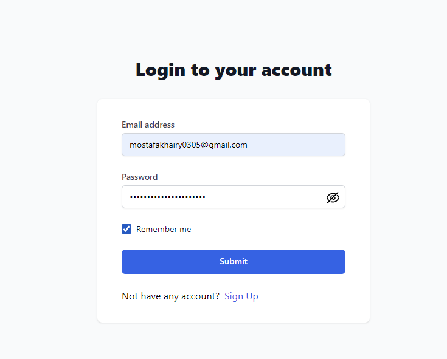

# ShopO by MERN Stack [<small>Live View</small>](https://shopo-5dq9.onrender.com)

## Project Overview

This is an e-commerce website built using the MERN (MongoDB, Express.js, React.js, Node.js) stack. The project includes features like user authentication using JSON Web Tokens (JWT), a dashboard specifically designed for sellers, and real-time messaging using Socket.IO.

## Technologies Used

- MongoDB: A document database used for data storage.
- Express.js: A web application framework for building the server-side of the application.
- React.js: A JavaScript library for building user interfaces.
- Node.js: A JavaScript runtime environment for executing server-side code.
- JSON Web Tokens (JWT): A standard for securing communications between parties.
- Socket.IO: A library for enabling real-time, bidirectional communication between clients and servers.

## Features

- User Authentication:
  - User registration and login using JWT for secure authentication.
  - Password hashing and salting for improved security.
  - Access control for protected routes.

- Seller Dashboard:
  - Manage products: Add, edit, and delete products.
  - View and process orders placed by customers.
  - Generate reports and analytics for sales and inventory.

- Real-time Messaging:
  - Enable real-time messaging between users using Socket.IO.
  - Implement features like chatrooms and private messaging.
## Page

## Dashboard

## Authentication
